# Implementando Minha Primeira Stack com AWS CloudFormation

Este repositório documenta a prática do desafio da DIO **"Implementando sua Primeira Stack com AWS CloudFormation"**. O objetivo foi entender como criar uma stack usando Infrastructure as Code, registrar o passo a passo executado e organizar os principais aprendizados para futuras consultas.

## Sobre o Desafio

O laboratório propõe a criação de uma primeira stack com o AWS CloudFormation, reforçando conceitos de provisionamento automatizado, templates declarativos e documentação técnica.

Durante a prática, foram estudados os seguintes pontos:

- Estrutura básica de um template CloudFormation em YAML.
- Criação de recursos AWS por meio de uma stack.
- Uso de parâmetros para tornar o template reutilizável.
- Uso de outputs para exibir informações úteis após o provisionamento.
- Monitoramento dos eventos de criação da stack.
- Importância da limpeza dos recursos para evitar custos.

## Objetivos de Aprendizagem

- Aplicar conceitos de infraestrutura como código em um ambiente prático.
- Documentar processos técnicos de forma clara e estruturada.
- Utilizar o GitHub como ferramenta de compartilhamento de conhecimento.
- Compreender o ciclo de vida de uma stack no AWS CloudFormation.
- Criar um material de apoio para revisões futuras.

## Tecnologias e Serviços Utilizados

- AWS CloudFormation
- Amazon EC2
- Security Group
- Amazon Linux
- Apache HTTP Server
- SSH
- Par de chaves EC2
- YAML
- Git e GitHub
- Markdown

## Estrutura do Repositório

```text
.
├── README.md
├── templates
│   └── webserver-stack.yaml
├── docs
│   ├── acesso-ssh.md
│   ├── anotacoes.md
│   ├── passo-a-passo.md
│   └── insights.md
└── images
    ├── 01-cloudformation-stack-create-complete.png
    ├── 02-stack-informacoes-gerais.png
    ├── 03-operacao-create-stack.png
    ├── 04-stack-eventos.png
    ├── 05-stack-recursos.png
    ├── 06-stack-saidas.png
    ├── 07-servidor-web-validado.png
    ├── 08-stack-parametros.png
    ├── 09-stack-modelo.png
    ├── 10-ec2-detalhes-instancia.png
    ├── 11-ec2-conectar-instancia.png
    ├── 12-s3-templates-cloudformation.png
    ├── 13-par-chave-chaveslinux.png
    ├── 14-erro-conexao-ssh.png
    ├── 15-validacao-ssh-sistema-apache.png
    └── 16-validacao-apache-curl-logs.png
```

## O Que Foi Implementado

Foi criado um template CloudFormation para provisionar uma instância EC2 simples com um servidor web Apache. A stack contém:

- Um parâmetro para definir a AMI mais recente do Amazon Linux.
- Um parâmetro para selecionar o tipo de instância.
- Um parâmetro para informar o par de chaves EC2 usado no SSH.
- Um parâmetro para informar o IP autorizado em formato CIDR.
- Um Security Group liberando HTTP na porta 80 e SSH na porta 22.
- Uma instância EC2 configurada via `UserData`.
- Um output com a URL pública do servidor web.
- Um output com o comando base para conexão SSH.

Nome definido para a stack no laboratório:

```text
dio-primeira-stack-thassio
```

Observação sobre acesso SSH:

O template atualizado usa o parâmetro `KeyName` para associar um par de chaves EC2 à instância Linux e libera a porta 22 no Security Group apenas para o IP definido em `MyIP`. O par de chaves deve existir antes da criação ou atualização da stack. Neste laboratório, foi usado o par existente `ChavesLinux`.

Guia de apoio:

[docs/acesso-ssh.md](docs/acesso-ssh.md)

O template principal está disponível em:

[templates/webserver-stack.yaml](templates/webserver-stack.yaml)

## Resumo do Template

O arquivo `webserver-stack.yaml` utiliza as seções principais de um template CloudFormation:

- `AWSTemplateFormatVersion`: define a versão do formato do template.
- `Description`: descreve o objetivo da stack.
- `Parameters`: permite customizar valores no momento da criação.
- `Resources`: declara os recursos AWS que serão criados.
- `Outputs`: exibe informações úteis após a criação da stack.

## Passo a Passo da Execução

1. Acessar o Console da AWS.
2. Abrir o serviço **CloudFormation**.
3. Clicar em **Create stack**.
4. Informar o template YAML da stack.
5. Definir o nome da stack como `dio-primeira-stack-thassio`.
6. Configurar os parâmetros solicitados:
   - `LatestAmiId`
   - `InstanceType`
   - `KeyName`
   - `MyIP`
7. Revisar as configurações.
8. Criar a stack.
9. Acompanhar os eventos até o status `CREATE_COMPLETE`.
10. Acessar a aba **Outputs** e abrir a URL gerada.
11. Validar a página web exibida pela instância EC2.
12. Excluir a stack após os testes para evitar cobranças.

O passo a passo detalhado está documentado em:

[docs/passo-a-passo.md](docs/passo-a-passo.md)

## Principais Aprendizados

CloudFormation permite descrever infraestrutura como código, o que facilita a padronização e repetição de ambientes. A prática mostrou que uma stack concentra o ciclo de vida dos recursos, permitindo criar, atualizar e remover componentes de maneira controlada.

Também ficou claro que parâmetros e outputs tornam o template mais reutilizável e mais fácil de operar, enquanto os eventos da stack ajudam a identificar rapidamente falhas durante o provisionamento.

Mais detalhes estão em:

[docs/insights.md](docs/insights.md)

## Cuidados Importantes

- Verificar a região AWS antes de criar a stack.
- Usar instâncias compatíveis com o nível gratuito quando aplicável.
- Restringir o parâmetro `MyIP` para o seu IP público com `/32`, sempre que possível.
- Criar e guardar a chave privada `.pem` em local seguro.
- Não enviar arquivos `.pem` para o GitHub.
- Excluir a stack ao final dos testes para evitar custos.
- Conferir se a conta possui uma VPC padrão ou adaptar o template para uma VPC existente.

## Evidências

Durante a execução do laboratório, foram registradas evidências da criação e validação da stack.

### Stack Criada com Sucesso

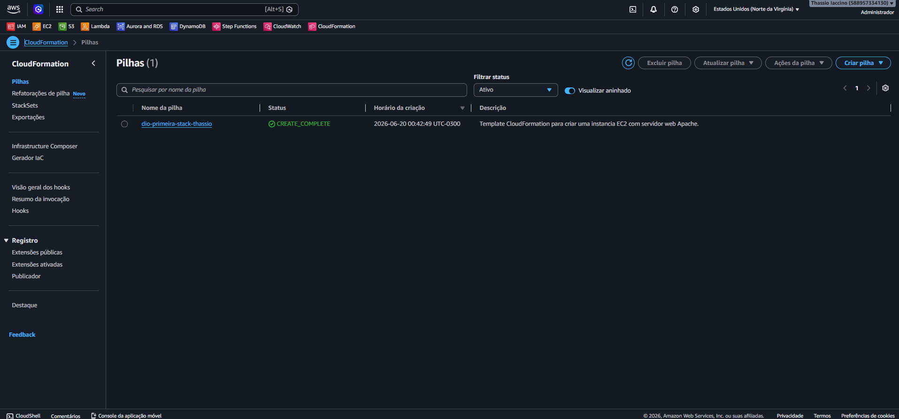

### Informações Gerais da Stack

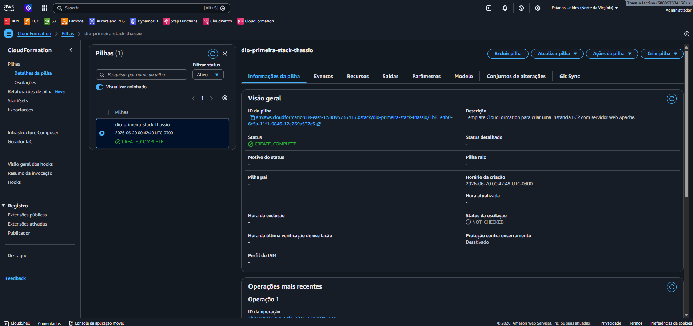

### Operação de Criação da Stack

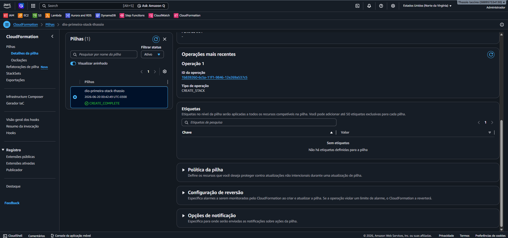

### Eventos da Stack

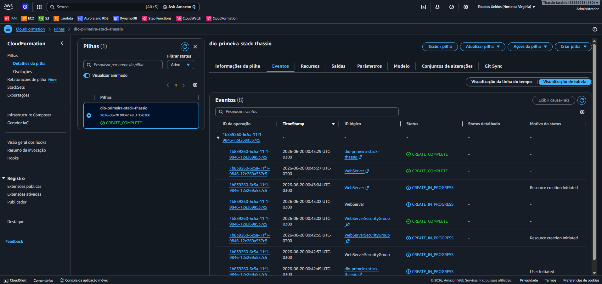

### Recursos Criados

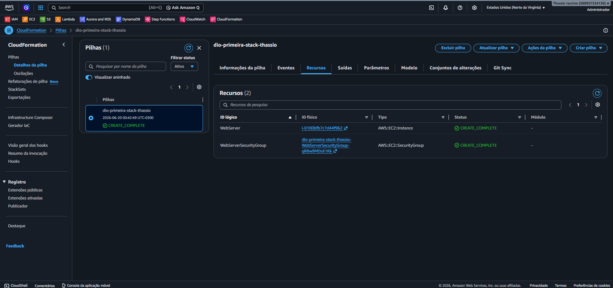

A stack criou os seguintes recursos principais:

- `WebServer`: instância EC2.
- `WebServerSecurityGroup`: Security Group associado ao servidor web.

### Saídas da Stack

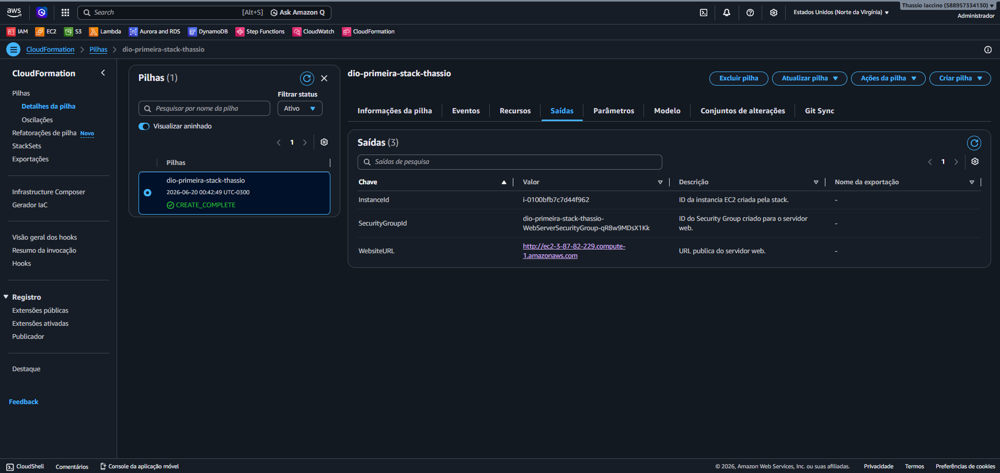

As saídas exibiram:

- ID da instância EC2.
- ID do Security Group.
- URL pública do servidor web.
- Comando base para conexão SSH.

### Servidor Web Validado

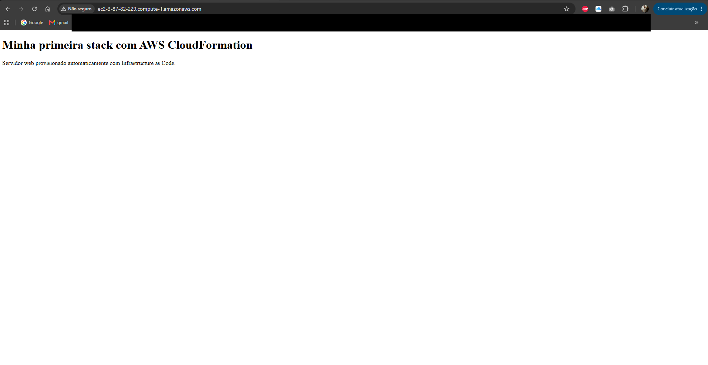

### Parâmetros Utilizados

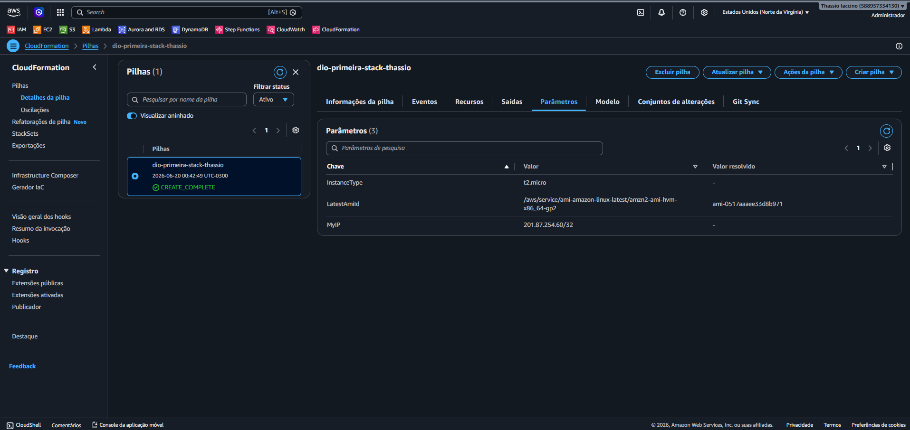

Parâmetros registrados na execução:

- `InstanceType`: `t2.micro`.
- `LatestAmiId`: AMI Amazon Linux resolvida pelo Parameter Store.
- `MyIP`: IP público autorizado em formato CIDR.

### Modelo da Stack no Console

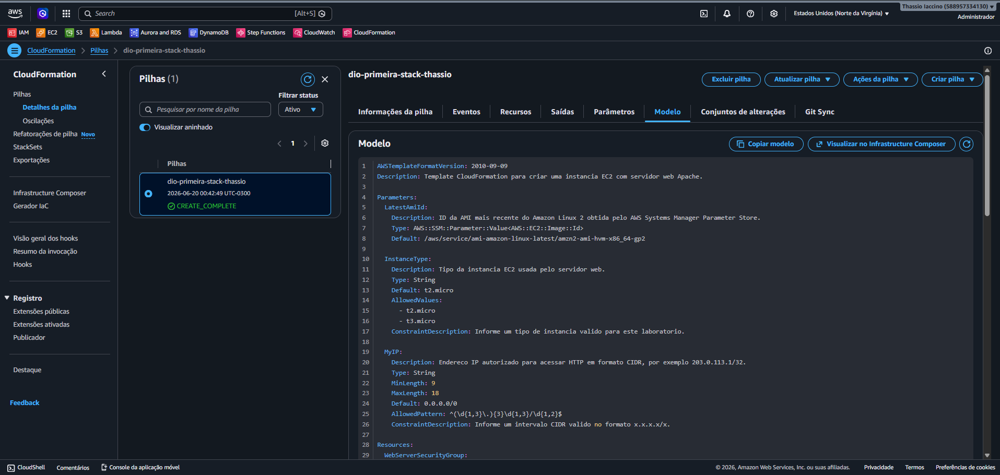

### Detalhes da Instância EC2

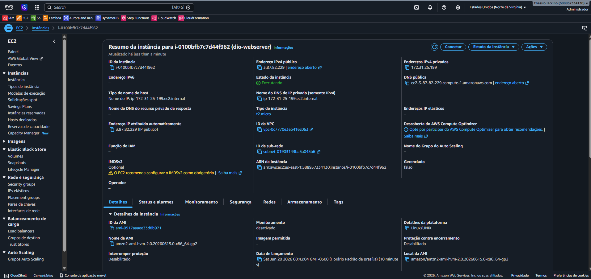

### Tela de Conexão da Instância

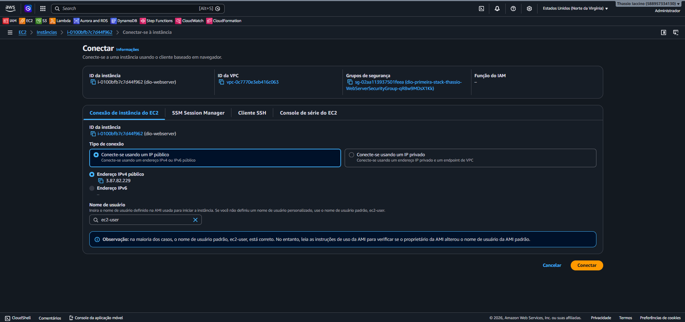

Após a criação do par de chaves e a atualização do template, a instância fica preparada para acesso remoto por SSH usando o usuário `ec2-user`.

### Par de Chaves Existente

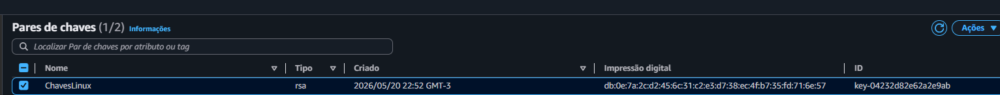

Foi utilizado um par de chaves EC2 já existente, chamado `ChavesLinux`, com a chave privada `.pem` armazenada fora do repositório.

### Erro ao Conectar por SSH pelo Console

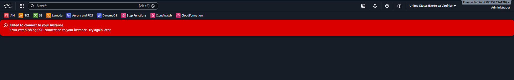

Durante o teste, o console exibiu erro ao tentar estabelecer conexão SSH. As causas mais prováveis são: instância criada antes da associação do `KeyName`, regra de entrada da porta 22 ausente ou restrita a outro IP, tentativa de uso do EC2 Instance Connect pelo navegador sem configuração compatível, ou uso de DNS/IP público antigo após recriação da instância.

### Validação via SSH

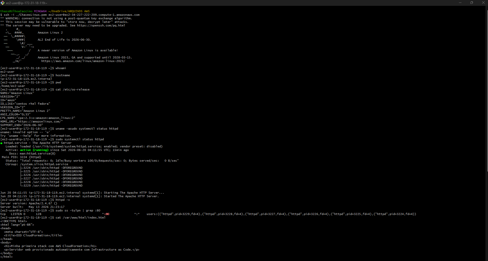

Após o acesso remoto com a chave `ChavesLinux`, foram executados comandos para validar o ambiente:

- `whoami`
- `hostname`
- `pwd`
- `cat /etc/os-release`
- `sudo systemctl status httpd`
- `httpd -v`
- `sudo ss -tulpn | grep :80`
- `cat /var/www/html/index.html`

### Validação do Apache e Página Local

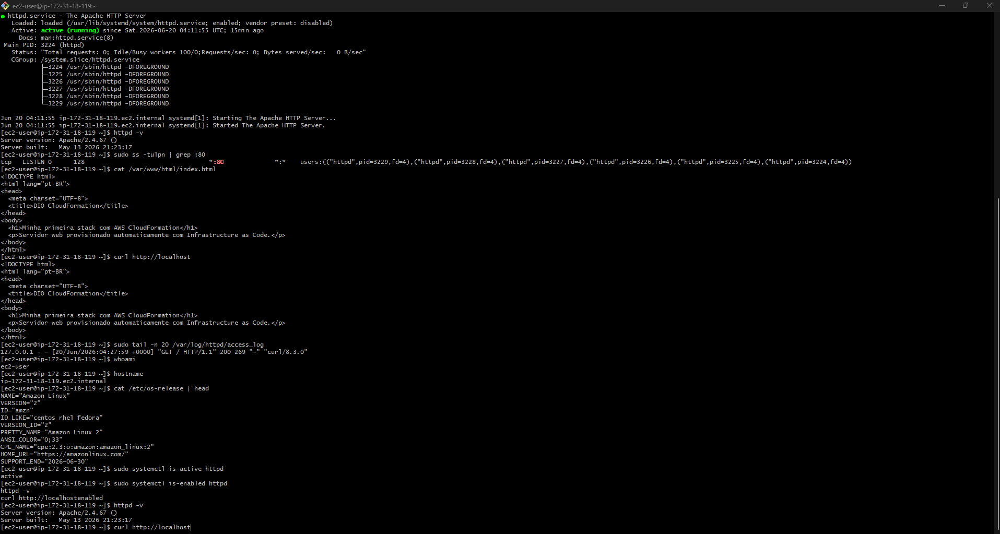

Também foram validados:

- Resposta local com `curl http://localhost`.
- Logs de acesso do Apache em `/var/log/httpd/access_log`.
- Status `active` do serviço `httpd`.
- Serviço `httpd` habilitado para iniciar com o sistema.

### Bucket S3 com Templates

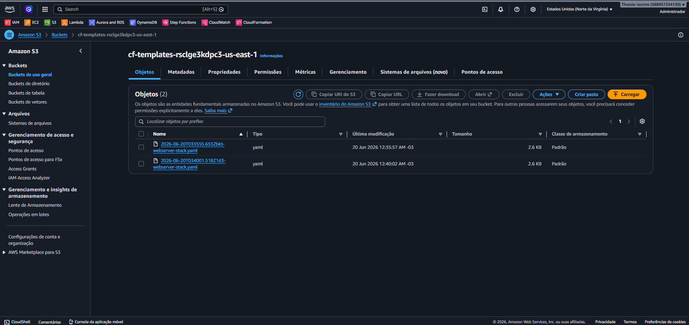

## Referências

- [AWS CloudFormation - Criar sua primeira pilha](https://docs.aws.amazon.com/pt_br/AWSCloudFormation/latest/UserGuide/gettingstarted.walkthrough.html)
- [Documentação AWS CloudFormation](https://docs.aws.amazon.com/AWSCloudFormation/latest/UserGuide/Welcome.html)
- [GitHub Markdown](https://docs.github.com/pt/get-started/writing-on-github/getting-started-with-writing-and-formatting-on-github/basic-writing-and-formatting-syntax)
- [GitHub Quick Start - DIO](https://github.com/digitalinnovationone/github-quickstart)

## Conclusão

Este desafio foi uma introdução prática ao uso do AWS CloudFormation para criar infraestrutura como código. A experiência ajudou a consolidar a importância de documentar configurações, automatizar provisionamentos e manter um repositório organizado para demonstrar a evolução técnica.
